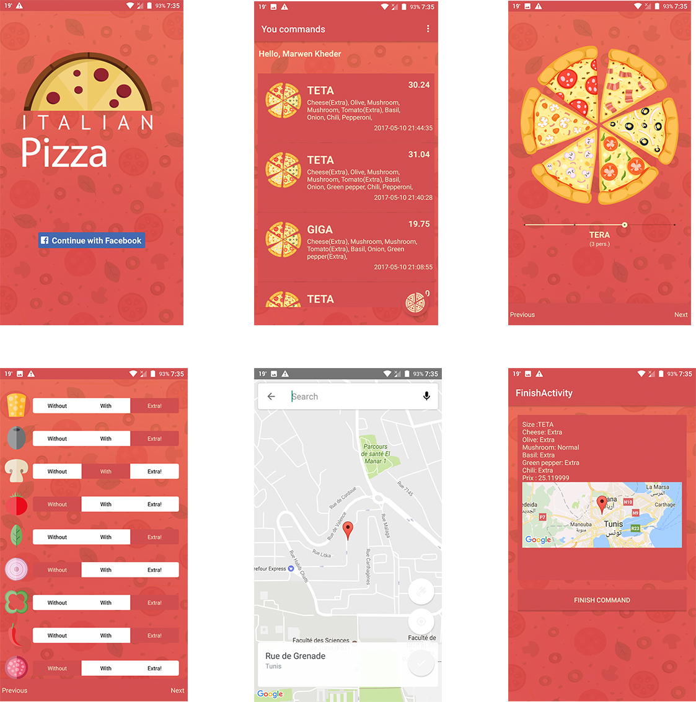

### Pizza delivery android application

This app is class project, where we asked to build android, where users can connect, see thier commands and pass new command.

###  Api keys to add

- Add facebook api and app id to strings.xml
- Add google map api to Manifest.xml file

### Used libs

[Leku](https://github.com/SchibstedSpain/Leku) For Location picker

[Android-Toggle-Switch](https://github.com/BelkaLab/Android-Toggle-Switch) For three states switch
### Credits
[Freepik](http://www.freepik.com) For for graphic resources  

### Licence
The MIT License (MIT)

Copyright (c) 2017 Kheder Marwen

Permission is hereby granted, free of charge, to any person obtaining a copy
of this software and associated documentation files (the "Software"), to deal
in the Software without restriction, including without limitation the rights
to use, copy, modify, merge, publish, distribute, sublicense, and/or sell
copies of the Software, and to permit persons to whom the Software is
furnished to do so, subject to the following conditions:

The above copyright notice and this permission notice shall be included in
all copies or substantial portions of the Software.

THE SOFTWARE IS PROVIDED "AS IS", WITHOUT WARRANTY OF ANY KIND, EXPRESS OR
IMPLIED, INCLUDING BUT NOT LIMITED TO THE WARRANTIES OF MERCHANTABILITY,
FITNESS FOR A PARTICULAR PURPOSE AND NONINFRINGEMENT. IN NO EVENT SHALL THE
AUTHORS OR COPYRIGHT HOLDERS BE LIABLE FOR ANY CLAIM, DAMAGES OR OTHER
LIABILITY, WHETHER IN AN ACTION OF CONTRACT, TORT OR OTHERWISE, ARISING FROM,
OUT OF OR IN CONNECTION WITH THE SOFTWARE OR THE USE OR OTHER DEALINGS IN
THE SOFTWARE.